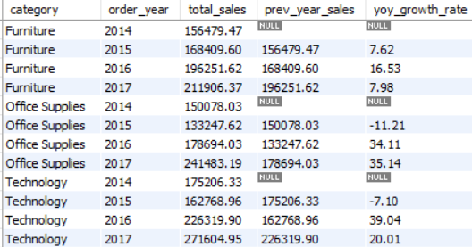
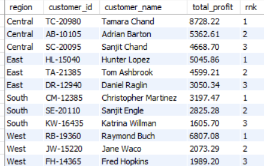
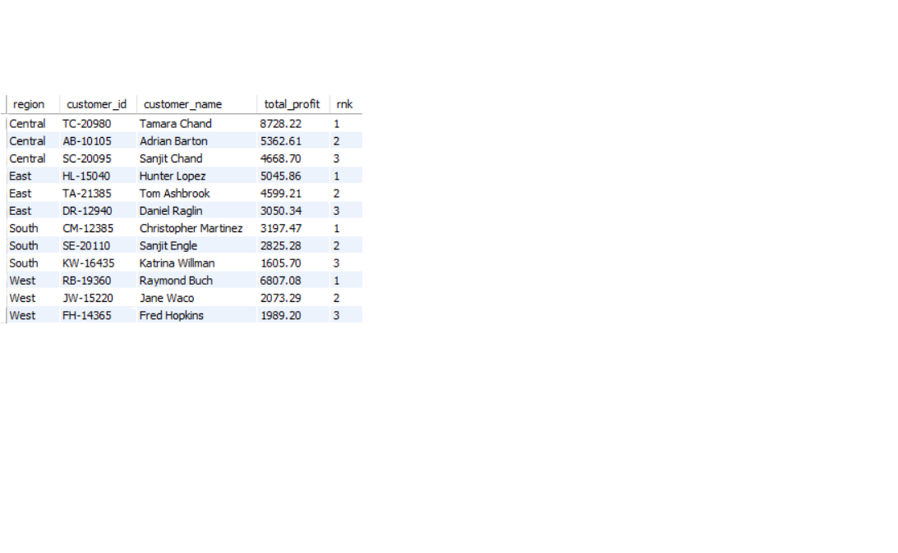
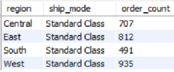
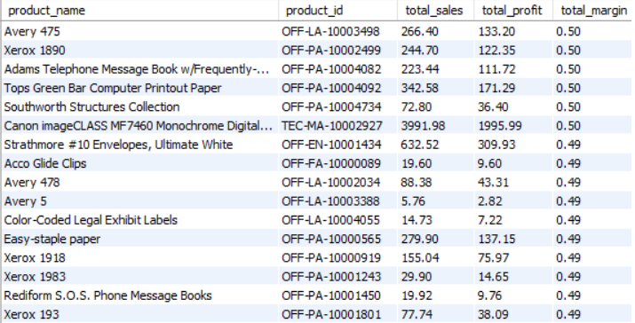

# Superstore Sales Database Analysis

## 📌 Project Overview
This project analyzes the **Superstore sales dataset** using SQL to uncover business insights related to customer behavior, product performance, shipping efficiency, profitability, discounts, and sales trends.

The objective is to demonstrate **practical SQL skills** by solving real-world business problems through data analysis and reporting.

---

## 🛒 Business Problem
Retail companies generate large amounts of sales data. Without proper analysis, it is difficult to identify:

- Most profitable customers
- Loss-making customers
- Delayed shipments
- High-performing products
- Impact of discounts on profit
- Regional sales trends
- Customer purchasing patterns

This project addresses these challenges using **SQL queries** and **business intelligence techniques**.

---

## 📂 Dataset Information
The Superstore dataset contains information about:

- **Customers**
- **Orders**
- **Products**
- **Sales**
- **Shipping Details**

### Tables Used
- **Customers** → Customer ID, Customer Name, Segment  
- **Orders** → Order ID, Order Date, Ship Date, Region, State, City, Ship Mode  
- **Products** → Product ID, Product Name, Category, Sub Category  
- **Sales** → Sales Amount, Profit, Discount, Quantity  

---

## 🛠️ Tools & Technologies
- MySQL  
- SQL  
- Power BI  
- Microsoft Excel  
- GitHub  

---

## 📖 SQL Concepts Used
### Basic SQL
- `SELECT`, `WHERE`, `ORDER BY`, `GROUP BY`, `HAVING`

### Intermediate SQL
- `INNER JOIN`, `LEFT JOIN`, Subqueries, Aggregate Functions

### Advanced SQL
- Window Functions (`RANK()`, `DENSE_RANK()`, `LAG()`)  
- Date Functions  
- Nested Queries  

---

## 📊 Project Analysis

### Customer Analysis
1. Top 5 Customers by Profit  
2. Customers Ordering from All Regions  
3. Customers with Negative Profit  
4. High Frequency Customers  
5. Customer Ranking by Segment  

### Shipping Analysis
6. Average Shipping Time by Ship Mode  
7. Shipping Time per Order  
8. Orders Delayed More Than 10 Days  
9. Most Common Ship Mode per Region  
10. Monthly Order Trends  
11. High Sales but Negative Profit Orders  

### Product Analysis
12. Top 5 Products by Profit  
13. Least Profitable Category per Region  
14. Average Discount by Subcategory  
15. Products Sold in All Regions  
16. Most Frequently Ordered Product  
17. Product Profit Margin Analysis  

### Sales Analysis
18. Top 3 Orders by Sales  
19. High Discount Profitability Check  
20. Largest Order per Customer  

### Advanced Analytics
21. Product Ranking by Profit  
22. Top Product per Category  
23. Year-over-Year Growth Analysis  
24. First Order Date per Customer  
25. Top 3 Customers per Region  

---

## 💡 Key Business Insights

### Customer Insights
- Identified customers contributing the highest profits.  
- Detected customers generating losses.  
- Recognized high-value repeat customers.  

### Shipping Insights
- Found delayed shipments impacting customer experience.  
- Identified preferred shipping methods across regions.  
- Measured average shipping performance.  

### Product Insights
- Determined most profitable products.  
- Identified low-performing categories.  
- Evaluated discount effectiveness.  

### Sales Insights
- Detected high-value transactions.  
- Analyzed discount impact on profitability.  
- Measured customer purchase behavior.  

### Growth Insights
- Evaluated yearly growth trends.  
- Compared category performance over time.  
- Ranked products and customers using window functions.  

---

## 📁 Project Structure

superstore-sales-sql-analysis/
├── Project.sql
├── README.md
├── Screenshots/
│   ├── Query_Results.png
│   └── Dashboard_Images.png
└── Presentation/


---

## 🎓 Learning Outcomes
Through this project I gained hands-on experience in:

- SQL Query Writing  
- Data Cleaning  
- Business Intelligence  
- Customer Analytics  
- Product Analytics  
- Window Functions  
- Performance Analysis  
- Data-Driven Decision Making  

---

## 👨‍💻 Author
**Rushikesh Narayan Sultane**  
BSc Data Science (2026)  

**Skills:** SQL, Power BI, Excel, Python, Data Analytics  

🔗 [LinkedIn](https://www.linkedin.com/in/rushi-sultane-32284b381)  
💻 [GitHub](https://github.com/rushi-7900)  
  


## 📝 SQL Queries Showcase

### Query 1: Year-over-Year (YoY) Sales Growth Rate by Category
```sql
SELECT 
    p.category,
    YEAR(o.order_date_clean) AS order_year,
    SUM(s.sales) AS total_sales,
    LAG(SUM(s.sales)) OVER (
        PARTITION BY p.category 
        ORDER BY YEAR(o.order_date_clean)
    ) AS prev_year_sales,
    ROUND(
        (
            SUM(s.sales) - LAG(SUM(s.sales)) OVER (
                PARTITION BY p.category 
                ORDER BY YEAR(o.order_date_clean)
            )
        ) /
        LAG(SUM(s.sales)) OVER (
            PARTITION BY p.category 
            ORDER BY YEAR(o.order_date_clean)
        ) * 100,
        2
    ) AS yoy_growth_rate
FROM products p
JOIN sales s ON p.product_id = s.product_id
JOIN orders o ON s.order_id = o.order_id
GROUP BY p.category, YEAR(o.order_date_clean)
ORDER BY p.category, order_year;
```



### Query 2: Top 3 Customers per Region by Profit Contribution
```sql
SELECT region, customer_id, customer_name, total_profit, rnk
FROM (
    SELECT 
        o.region,
        c.customer_id,
        c.customer_name,
        SUM(s.profit) AS total_profit,
        RANK() OVER (
            PARTITION BY o.region
            ORDER BY SUM(s.profit) DESC
        ) AS rnk
    FROM customers c
    INNER JOIN orders o ON c.customer_id = o.customer_id
    INNER JOIN sales s ON o.order_id = s.order_id
    GROUP BY o.region, c.customer_id, c.customer_name
) ranked
WHERE rnk <= 3
ORDER BY region, rnk;
```



### Query 3: Rank Customers by Total Sales Within Each Segment
```sql
SELECT
    c.segment,
    c.customer_id,
    c.customer_name,
    SUM(s.sales) AS total_sales,
    RANK() OVER (
        PARTITION BY c.segment
        ORDER BY SUM(s.sales) DESC
    ) AS ranking
FROM customers c
INNER JOIN orders o ON c.customer_id = o.customer_id
INNER JOIN sales s ON o.order_id = s.order_id
GROUP BY c.segment, c.customer_id, c.customer_name
ORDER BY c.segment, ranking;
```



### Query 4: Most Common Ship Mode Used in Each Region
```sql
SELECT region, ship_mode, order_count
FROM (
    SELECT
        o.region,
        o.ship_mode,
        COUNT(*) AS order_count,
        RANK() OVER (
            PARTITION BY o.region
            ORDER BY COUNT(*) DESC
        ) AS rnk
    FROM orders o
    GROUP BY o.region, o.ship_mode
) ranked
WHERE rnk = 1
ORDER BY region;
```



### Query 5: Profit Margin Analysis for Each Product
```sql
SELECT
    p.product_name,
    p.product_id,
    SUM(s.sales) AS total_sales,
    SUM(s.profit) AS total_profit,
    ROUND(SUM(s.profit) / SUM(s.sales), 2) AS total_margin
FROM products p
INNER JOIN sales s ON p.product_id = s.product_id
GROUP BY p.product_name, p.product_id
ORDER BY total_margin DESC;
```

